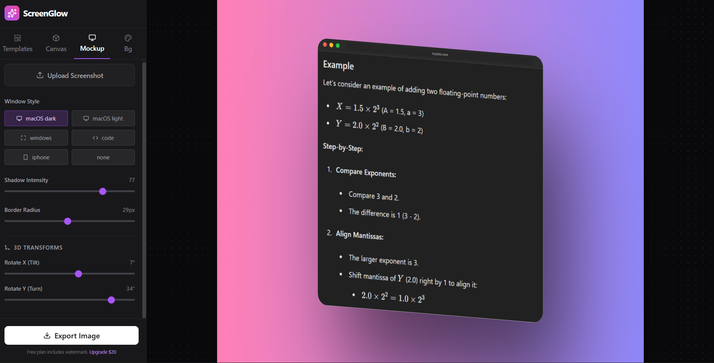
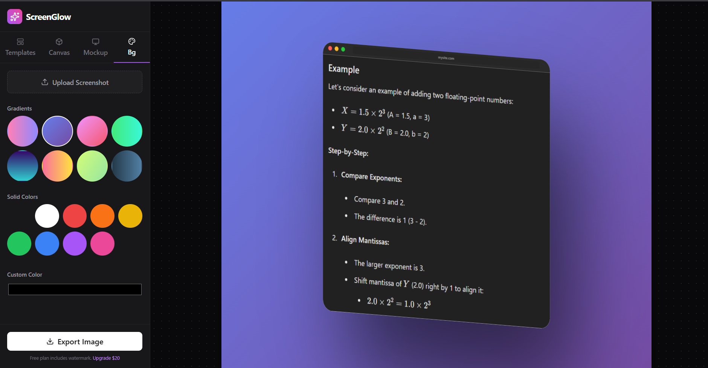
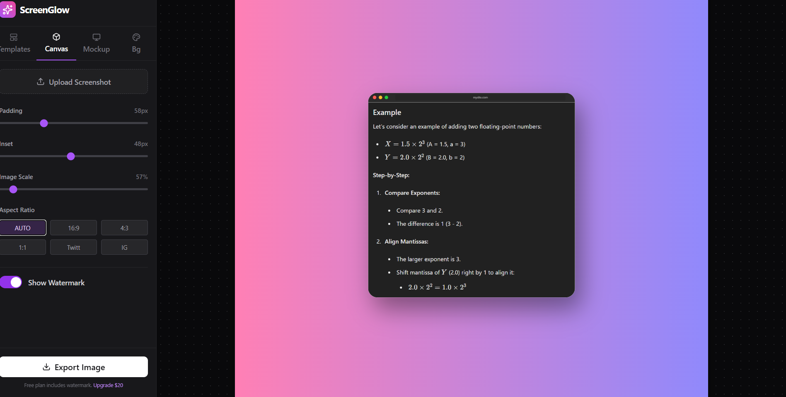
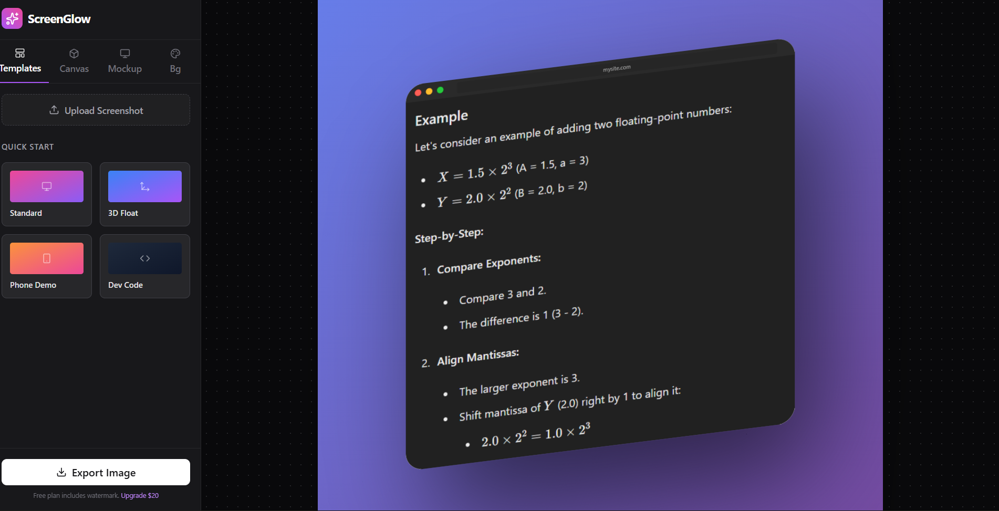

# SnapFrame 📸✨

Live Demo: 👉 https://snapframe-rho.vercel.app/

**SnapFrame** is a powerful, client-side screenshot beautifier that helps developers, designers, and content creators turn plain screenshots into eye-catching visuals perfect for social media, portfolios, and product launches.

## ✨ Features

### 🖼️ Device Mockups
- **Browser Windows** - Chrome, Safari, Firefox style frames
- **Mobile Devices** - iPhone, Android phone mockups
- **Laptops** - MacBook Air/Pro style frames
- **Terminal Windows** - Developer-focused command line mockups
- **Code Editors** - VS Code style with syntax highlighting

### 🎨 Visual Effects
- **Gradient Backgrounds** - 20+ preset gradients or create custom ones
- **Shadow Effects** - Professional depth with adjustable blur and opacity
- **Rounded Corners** - Customizable border radius
- **Padding Control** - Adjust spacing on all sides
- **Noise Texture** - Add premium grain effect

### 📱 Social Media Frames
- Twitter/X post mockups
- LinkedIn post templates
- Instagram post/story frames
- Code snippet sharing style
- Terminal screenshot style

### 🛠️ Editing Tools
- **Privacy Blur** - Hide sensitive information
- **Text Overlays** - Add titles, captions, and annotations
- **Annotations** - Arrows, shapes, and callouts
- **Crop & Resize** - Optimize for any platform
- **Filters** - Brightness, contrast, saturation adjustments

## 🖼️ Gallery

### Device Mockups

*Browser, iPhone, MacBook, and Terminal mockups*

### Background Options

*Gradient backgrounds, solid colors, and custom images*

### Canvas Editor

*Intuitive editing interface with real-time preview*

### Template Library

*Pre-designed templates for quick styling*

## 🚀 Quick Start

### Basic Workflow

1. **Upload Screenshot** - Drag & drop or click to upload
2. **Choose Mockup** - Select device frame (browser, phone, laptop, etc.)
3. **Apply Effects** - Add gradients, shadows, and styling
4. **Customize** - Adjust colors, padding, corners
5. **Export** - Download as PNG/JPG in your desired resolution

## 🌟 Show Your Support

If you find SnapFrame useful, please consider:
- ⭐ Starring the repository
- 🐦 Sharing on Twitter
- 💼 Sharing on LinkedIn
- 📝 Writing a blog post

## 📧 Contact

- Website: [snapframe.app](https://snapframe.app)
- Twitter: [@snapframe](https://twitter.com/snapframe)
- Email: hello@snapframe.app

## 🙏 Acknowledgments

- Device mockups inspired by [Shots.so](https://shots.so)
- Gradient presets from [WebGradients](https://webgradients.com)
- Icons by [Lucide Icons](https://lucide.dev)

---

Made with ❤️ by developers, for developers

⭐ Star us on GitHub — it helps!
